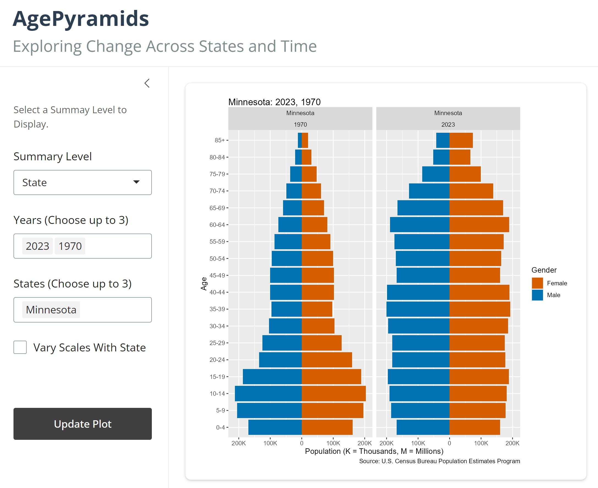

# AgePyramids

## Overview
This Shiny R application plots age pyramids from population estimates (1970–2023) 
produced by the U.S. Census Bureau’s [Population Estimates Division](https://www.census.gov/programs-surveys/popest/data/data-sets.html). 
The focus is on state and national data from 1970 to 2023.  

[AgePyramids](https://0198350e-9fc7-b648-3f4a-1c47e53cddb3.share.connect.posit.cloud/)

## Population Estimates

- [Postcensal Estimates](https://www.census.gov/programs-surveys/popest/guidance.html): 
Calculated after each decennial census using data on births, deaths, and migration.
- [Intercensal Estimates](https://www.census.gov/programs-surveys/popest/technical-documentation/research/intercensal-estimates.html): Adjust postcensal figures to align with the subsequent 
census count. The adjustment is distributed across the decade to match April 1 
census totals.

Population estimates reflect the population as of **July 1** each year, 
which may differ from April 1 census counts during census years.

## Data Sources

Data are pulled from publicly available datasets. The following URLs **download**
portions of the data used.

*  [1970-1979](https://www2.census.gov/programs-surveys/popest/tables/1900-1980/counties/asrh/co-asr-7079.csv)
*  [1980-1989](https://www2.census.gov/programs-surveys/popest/datasets/1980-1990/counties/asrh/pe-02.csv)
*  [1990-1999](https://www2.census.gov/programs-surveys/popest/tables/1990-2000/intercensal/st-co/stch-icen1990.txt)
*  [2000-2009, Vintage 2011](https://www2.census.gov/programs-surveys/popest/datasets/2000-2010/intercensal/county/co-est00int-alldata-01.csv)
*  [2010-2019, Vintage 2020](https://www2.census.gov/programs-surveys/popest/datasets/2010-2020/counties/asrh/CC-EST2020-ALLDATA6.csv)
*  [2020-2023, Vintage 2023](https://www2.census.gov/programs-surveys/popest/datasets/2020-2023/counties/asrh/cc-est2023-alldata.csv)

The vintage corresponds to the last year available in the time series estimates.
File organization differs by year or state.

## Data Preparation in R

- The application uses [DuckDB](https://duckdb.org/), a database using columnar-based storage,
offering strong compression and high-speed queries.
- Queries are performed using the [duckplyr](https://duckdb.org/2024/04/02/duckplyr.html) 
extension in R, which supports lazy evaluation—results are only materialized when needed.
